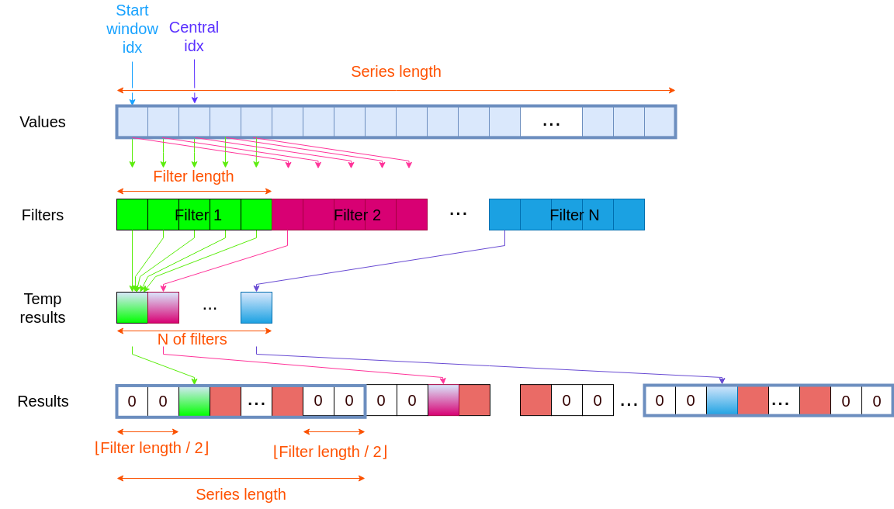
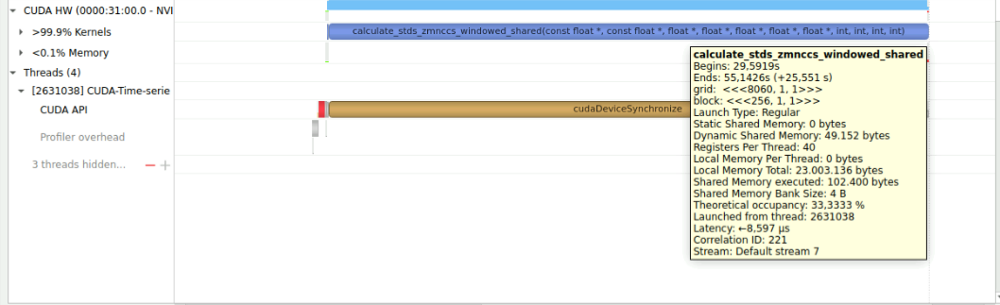

# Time Series Pattern Recognition

  
Table of Contents

  <ol>
    <li><a href="#about">About</a></li>
    <li><a href="#software-environment">Software Environment</a></li>
    <li><a href="#how-the-algorithm-works">How the algorithm works</a></li>
    <li><a href="#execution-mechanism">Execution mechanism</a></li>
    <li><a href="#test-methodology">Test methodology</a></li>
    <li><a href="#results-analysis">Results analysis</a></li>
    <li><a href="#profiling">Profiling</a></li>
    <li><a href="#appendix">Appendix</a></li>
    <li><a href="#project-authors">Project Authors</a></li>
  </ol>

## About
In the following project, I developed several **sequential and parallel implementationsof an algorithm that, from a shorter time series and a longer time series, provides a new time series that estimates the similarity at each time instant between the two series**. To calculate the similarity, one can choose to apply either the **SAD (Sum of Absolute Differencies) metric or the ZMNCC (Zero Mean Normalized Cross-Correlation) metric**. The project was developed **from scratch in C/C++/CUDA using only the standard libraries**. The OpenMP framework was chosen for the parallel implementation on CPU while CUDA was used for the GPU implementation. **Benchmarks** were created to go and compare the execution times of the different implementations and also the use of the different metrics. The following paragraphs explain how the metrics are applied to the time series and then provide a description of the hardware configuration used and the tools used to analyze system performance. Finally there is a comparison of the performance obtained on the benchmarks by the different implementations and finally a summary of the speedup obtained. 

## Software Environment
- **Operating System**: Ubuntu 22.04 LTS (5.19.0-46-generic)
- **C/C++ Compiler**: GCC 11.4.0
- **Parallel framework**: OpenMP 5.0
- **Parallel framework**: CUDA release 11.8
  
## How the algorithm works
The search for similarity between two time series can be seen as applying a filter (shorter time series) at all positions of the longer time series. To apply a filter $f$ of length $flen$ and obtain the result at the $i$-th index one places the center of the filter at the $i$-th index of the longer series $s$. Between the filter values and the window of selected series values, the SAD metric is to be applied:

$$SAD[i] = \sum_{j=0}^{len} \left|s[i + j - \frac{len}{2}] - f[j] \right|$$

Then running the filter over the entire longer time series will give all the similarity results for each position $i$. Since it is required that the filter be completely contained in the time series we will have that the similarity result will also be a time series, but shorter than the longer time series by an amount equal to the length of the filter.

In the case of ZMNCC metric the alignment part of the two time series is the same, the difference being that from the window centered at the $i$ index of values in the series the mean and standard deviation must also be obtained. The mean and standard deviation of the filter must also be calculated. Once all these values are obtained, one can calculate:

$$ZMNCC[i] = \frac{1}{flen} \sum_{j=0}^{flen} \frac{(s[i + j - \frac{flen}{2}] - \bar{s}[i])(f[j] - \bar{f})}{\sigma_s \sigma_f}$$

Where:

$$\sigma_s = \sqrt{\sum_{j=0}^{flen} (s[i + j - \frac{flen}{2}] - \bar{s}[i])^2}$$

$$\sigma_f = \sqrt{\sum_{j=0}^{flen} (f[j] - \bar{f})^2}$$

Again, the similarity result will also be a time series, but shorter than the longest time series by an amount equal to the length of the filter. Given the greater number of operations required, one has that the calculation of the ZMNCC metric is more onerous than SAD, at the same time, however, the results obtained are often more informative and therefore more useful.

## Execution mechanism
In order to apply a larger number of filters simultaneously, it was chosen to store the filter bank as a contiguous array of elements. The values of the time series window are in this way used several times to obtain the result of applying the various filters to the $i$-th index. These values are saved in a temporary array and later are moved to the results array. A representation of the operation is shown in figure below. The task of each thread then is to compute the application of all filters to the window centered at index $i$-th and save the results in memory.

*Representation of execution*

In the GPU version using shared memory, on the other hand, there is a slight difference in the initial phase. In order for a block to execute you will have to have in shared memory all the elements not only of the window at the $i$-th index, but also all the values necessary to be able to center the window in the range $[i, i + flen]$. So in the first phase of the kernel each thread within the block will have to load one tile of the time series. Having done this it will wait for all threads in its block to finish using a synchronization directive between threads in the block. At this point it will be possible to apply filters as seen above. A schematic of the operation is shown in figure.

*Representation of execution with shared mem*

**Note**: to increase memory access efficiency more, it might be useful to arrange the data differently. For example instead of arranging the elements of a filter contiguously one could create an arrangement as shown in figure below where the filters are stored alternately. With this stratagem we have that when fetching a particular value contained at an index of the filter will probably also be obtained values of other filters that will be used in the same iteration. Similar reasoning can be made for transcribing results from the temporary array to the permanent array: since writing contiguous memory areas is faster the method shown should improve performance.  

*Representation of other way of execution*

## Test methodology
In order to be able to objectively analyze the different performances of the present implementations, it was necessary to create a special benchmark. This benchmark consists of applying the different implementations and metrics to a fixed dataset. The dataset under consideration is the [Household Electric Power Consumption](https://doi.org/10.24432/C58K54) and within it there are measurements of a household's electricity consumption with a sampling rate of one minute over a period of almost 4 years (over 2 million datapoints). To achieve better reproducibility of the results, one has that the same test is run several times and an average of the times obtained is calculated. For some combinations of implementations and filters the dataset was too short and could overweight the initialization times it was decided to increase the length of the dataset by replicating the present values. The tests were performed on a workstation provided by the University of Florence with OS Ubuntu 22.04, 2x Intel Xeon Silver 4314 CPU (2x 16 cores/2x 32 threads) and Nvidia RTX A2000 12GB GPU. It should be kept in mind that the workstation was used by a considerable number of users at the same time and therefore the results obtained are affected by fair variability.

## Results analysis

### SAD
Figure below shows the average time required to complete the SAD benchmark. As can be seen, the performance with CUDA is better with times about 6 times less than OpenMP with 64 threads, 7 times than OpenMP with 32 threads, and 9 times than OpenMP with 16 threads.

*N Filters: 8 - Filter Length: 12032 - Series Length: 2075260 $\cdot$ 10*

Instead, next figure shows the performance as the length of the series to be analyzed varies.  

*Performance as the series length varies with N Filters: 8 - Filter Length: 12032*

As can be seen from the previous images we have that increasing the number of threads results in improved performance, but not in a linear fashion. This behavior is highlighted by the next graph where the performance as the threads vary are shown. 

*Performance as the number of threads varies  with N Filters: 8 - Filter Length: 12032 - Series Length: 2075260 $\cdot$ 10*

Since no synchronization is present within the code, this bottleneck could be related to memory access saturation. Thus, the use of faster memories should bring substantial performance gains with use of more threads. On the other hand, the improved CUDA performance could be related to the simplicity of the operations to be performed (very suitable to be computed on video hardware), as well as to the higher speed of the video memory.

### ZMNCC
A CUDA implementation of the ZMNCC metric was also performed using shared memory. In this case, the dataset was divided into tiles and each thread was tasked with loading into memory the data needed for the whole block to compute a certain number of values. The number of data needed is directly related to the length of the filter, longer filters in fact require more values from the dataset. Working with longer filters therefore requires loading more values from the time series into shared memory to compute. This causes an increase in the use of bytes in shared memory going to decrease the number of warps able to execute in each multiprocessor stream and thus the theoretical occupancy (computable from [here](https://xmartlabs.github.io/cuda-calculator/)). Using the Nvidia Nsight analyzer it is possible to verify this problem, as shown in next figure, where an occupancy of 33.3% is obtained.

*ZMNCC execution profiling with Filter Length: 12032 and shared memory*

To decrease the number of bytes of shared memory per block, we simply need use filters of shorter length. For example, using filters of length 1792 results in a utilization of 100% as shown in figure below.

*ZMNCC execution profiling with Filter Length: 1792 and shared memory*

Experimentally, however, even shortening the length of the filters still did not show substantial differences in run times.

In next figure you can see a comparison of performance between the various implementations produced. 

*N Filters: 8 - Filter Length: 12032 - Series Length: 2075260*

The near-perfect performance similarity between the version with shared memory and the version without the use of shared memory was initially blamed on the choice of filter length, but as discussed earlier this difference modification is not significant in increasing the performance of the version with shared memory. In the case of ZMNCC, compared with SAD, we can see a greater linearity between number of threads used and decrease in benchmark execution time. This relationship could be related to the fact that the ZMNCC metric is much more computationally expensive and therefore the memory bottleneck is less influential as memory accesses are distributed over longer times. The figure below shows the behavior of the OpenMP implementation as the number of threads varies.

*Performance as the number of threads varies  with N Filters: 8 - Filter Length: 12032 - Series Length: 2075260*

We can see that increasing (in a "not excessive" way) the number of threads gives a good return in performance. In contrast, increasing the number of threads "excessively" leads to a flattening in performance improvement.

The next graph shows the variation in performance as the length of the time series changes.

*Performance as the series length varies with N Filters: 8 - Filter Length: 12032*

## Profiling
To analyze the execution in more detail, it is possible to use the [Intel vTune Profiler](https://www.intel.com/content/www/us/en/developer/tools/oneapi/vtune-profiler.html) tool regarding the CPU and to use the [Nvidia Nsight Systems](\href{https://developer.nvidia.com/nsight-systems}) tool regarding the GPU.

## Appendix
The following figure shows a visualization of the produced time series. The first graph is the time series of power consumption, the second is the uptrend filter applied (one can see the length of this filter compared to the original series). The third graph is the result of applying the filter with ZMNCC metric and the fourth graph is the application of the filter with SAD metric.

*Example of a graph showing the time series produced*

## Project Authors
This project was carried out by Jacopo Damerini for the course "Parallel Computing" in the Advanced Computing curriculum of the Master of Science degree in Computer Engineering at the Università degli Studi di Firenze. 
The project assignment was directed by: 
* Marco Bertini - Associate Professor - Università degli Studi di Firenze

The project was developed by:
* Jacopo Damerini - Student - Florence (Italy)
